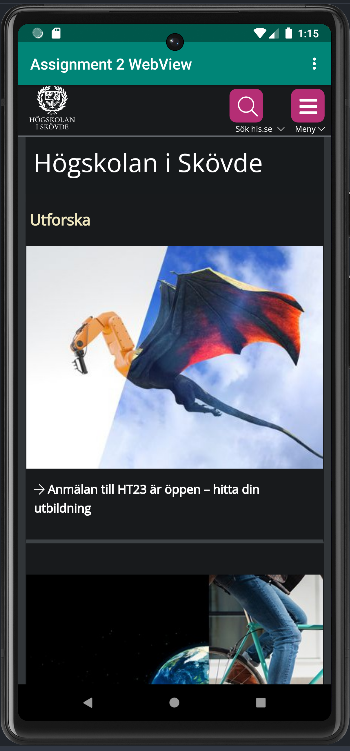
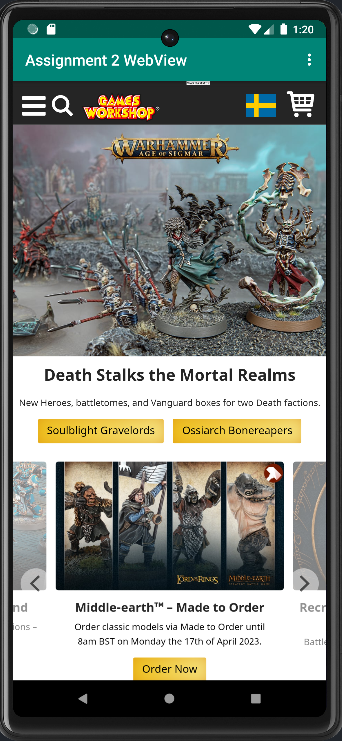

# Rapport

**Skriv din rapport här!**

_Du kan ta bort all text som finns sedan tidigare_.

## Följande grundsyn gäller dugga-svar:

- Ett kortfattat svar är att föredra. Svar som är längre än en sida text (skärmdumpar och programkod exkluderat) är onödigt långt.
- Svaret skall ha minst en snutt programkod.
- Svaret skall inkludera en kort övergripande förklarande text som redogör för vad respektive snutt programkod gör eller som svarar på annan teorifråga.
- Svaret skall ha minst en skärmdump. Skärmdumpar skall illustrera exekvering av relevant programkod. Eventuell text i skärmdumpar måste vara läsbar.
- I de fall detta efterfrågas, dela upp delar av ditt svar i för- och nackdelar. Dina för- respektive nackdelar skall vara i form av punktlistor med kortare stycken (3-4 meningar).

Programkod ska se ut som exemplet nedan. Koden måste vara korrekt indenterad då den blir lättare att läsa vilket gör det lättare att hitta syntaktiska fel.

```
function errorCallback(error) {
    switch(error.code) {
        case error.PERMISSION_DENIED:
            // Geolocation API stöds inte, gör något
            break;
        case error.POSITION_UNAVAILABLE:
            // Misslyckat positionsanrop, gör något
            break;
        case error.UNKNOWN_ERROR:
            // Okänt fel, gör något
            break;
    }
}
```

Bilder läggs i samma mapp som markdown-filen.


------------------------------------------------------------------------------------------------

Först av allt forkade jag projektet från GitHub och klonade den forken till min dator så jag kan öppna den i Android Studio. Efter det ändrade jag också namn på filen till 
"Assignment 2 Webview" i strings.xml och AndroidManifest.xml, där jag även gav appen tillgång till internet genom user.permissions i AndroidManifest.xml.

```xml
...
<uses-permission android:name="android.permission.INTERNET"/>
...
```
Nu när appen har tillgång till internet ändrade jag <Textview> till <Webview> för att göra det möjligt att visa en hemsida i appen. Jag angav även ett "webViewID" som ID så att jag kan kalla
på <Webview> i nästa steg.
```xml
<WebView
    android:layout_width="wrap_content"
    android:layout_height="wrap_content"
    android:text="@string/app_name"
    app:layout_constraintBottom_toBottomOf="parent"
    app:layout_constraintEnd_toEndOf="parent"
    app:layout_constraintStart_toStartOf="parent"
    app:layout_constraintTop_toBottomOf="@+id/appBarLayout"
    android:id="@+id/webViewID" />
```

Sedan importerade jag datan från "webViewID" till variabeln "webViewMain" i "MainActivity.java" där jag även deklarerar en client där webviewen ska visas.
Efter det satte jag på att man kan använda javascript och sedan lade in URL-en för appens startsida till högskolans hemsida.  



```java
    protected void onCreate(Bundle savedInstanceState) {
    super.onCreate(savedInstanceState);
    setContentView(R.layout.activity_main);
    Toolbar toolbar = findViewById(R.id.toolbar);
    webViewMain = findViewById(R.id.webViewID);
    webViewMain.setWebViewClient(new WebViewClient()); // Do not open in Chrome!
    webViewMain.getSettings().setJavaScriptEnabled(true);
    webViewMain.loadUrl("https://his.se");
    setSupportActionBar(toolbar)
```

Som internal web page använda jag mig av index.html som lagras i appen. Som external web page valde jag en hemsida för
spelföretaget Games Workshop för att göra en tydlig skillnad mellan startsidan och external web page.




```java
    public void showExternalWebPage(){
        // TODO: Add your code for showing external web page here
        webViewMain.loadUrl("https://www.games-workshop.com/en-SE/Home");
    }

    public void showInternalWebPage(){
        // TODO: Add your code for showing internal web page here
        webViewMain = findViewById(R.id.webViewID);
        webViewMain.setWebViewClient(new WebViewClient()); // Do not open in Chrome!
        webViewMain.getSettings().setJavaScriptEnabled(true);
        webViewMain.loadUrl("file:///android_asset/index.html");
    }
```

Läs gärna:

- Boulos, M.N.K., Warren, J., Gong, J. & Yue, P. (2010) Web GIS in practice VIII: HTML5 and the canvas element for interactive online mapping. International journal of health geographics 9, 14. Shin, Y. &
- Wunsche, B.C. (2013) A smartphone-based golf simulation exercise game for supporting arthritis patients. 2013 28th International Conference of Image and Vision Computing New Zealand (IVCNZ), IEEE, pp. 459–464.
- Wohlin, C., Runeson, P., Höst, M., Ohlsson, M.C., Regnell, B., Wesslén, A. (2012) Experimentation in Software Engineering, Berlin, Heidelberg: Springer Berlin Heidelberg.
